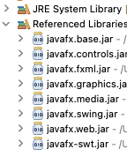
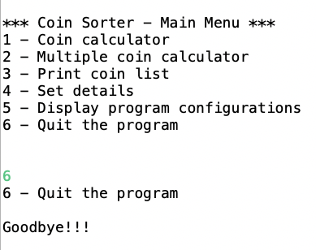
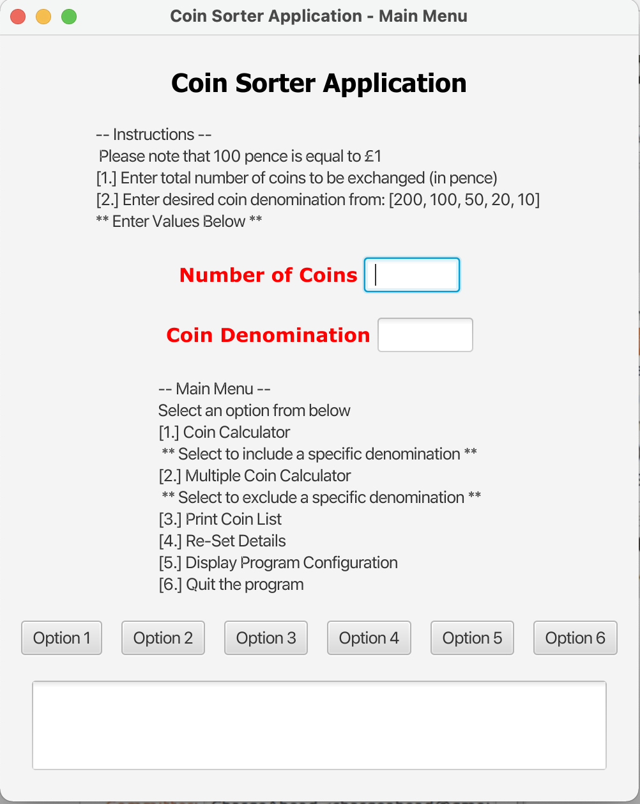

# Coin Sorter Application
## Project Brief:
### 1. To develop a coin sorting program, using Pound sterling (£) as the default currency. 

The following coins (in order of priority) are in circulation in the scope of this program:
Note: 1 pound is equal to 100 pennies e.g. £1 = 100p.

• £2 (equivalent to 200p)

• £1 (equivalent to 100p)

• 50p

• 20p

• 10p

The minimum input value for exchange in pennies is 0 (inclusive). The maximum input value
for exchange in pennies is capped at 10,000 (inclusive).

The program should enable the user to check, at most, how many coins of a certain
denomination can be exchanged given an input value in pennies and the denomination. It
should also print the remainder. For example, given the input value of 352 pennies and the
input denomination of £1 coins, the output should be three £1 coins and a remainder of
52p.

Given a total value in pennies and a coin denomination to exclude, the program should also
allow the user to determine how many coins and what denominations (prioritising the
higher denominations) they can exchange for while excluding a certain coin denomination.
The remainder should also be printed. For example, given 563 pennies and excluding the £2
coin, we can exchange for five £1 coins, one 50p coin and one 10p coin, with a remainder of
3p.

### 2. To develop a Textual Menu for the coin sorting program.

### 3. To develop a Graphical Menu using JavaFX for the coin sorting program.

## Prerequisites:
1. It is an Eclipse project.
2. Make sure Runtime and JavaFX dependencies are installed / up to date.



3. You can run both Textual (testCoinSorter.java) and JavaFX (testCoinSorterGUI.java) menu's from the Eclipse IDE.
Sometimes, the JavaFX application will not run from the IDE, if that happens, run from command line. Personally, I 
prefer running JavaFX applications from the command line because it helps with debugging. 

## Installing:
1. Clone the repo

```
https://github.com/AAdewunmi/CoinSorter.git
```

2. Open Project Folder


3. Explore

Enjoy :)

## App UI:

1. Textual Menu



2. JavaFX Menu



